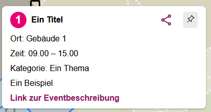

# campusmap_event_converter

## Nutzung
1. Ausfüllen der Datei 'Vorlage.csv' mit den Daten der Veranstaltung. Die Datei 'Vorlage.csv' kann auch umbenannt werden.
2. Falls Dateinamen geändert wurde, müssen die Variabelwerte im 'converter.py' geändert werden.
3. Ausführen des 'converter.py' Skripts.
4. event.geojson wird erstellt, bzw. überschrieben.
5. event.geojson der inhalt von event.geojson kann bei der campusmap als neues event.geojson genutzt werden.

## Vorlage.csv
Die Datei 'Vorlage.csv' hat folgende Spalten:
1. Spalte A: Thema: Thema des Events
2. Spalte B: Nr: Nummer des Events
3. Spalte C: Zeitbemerkung: Zeit des Events
4. Spalte D: Raum: Raum des Events
5. Spalte E: lat: latitude
6. Spalte F: lon: longitude
7. Spalte G: Titel: Titel des Events
8. Spalte H: Beschreibung: Beschreibung des Events
9. Spalte I: Link: Link des Events

